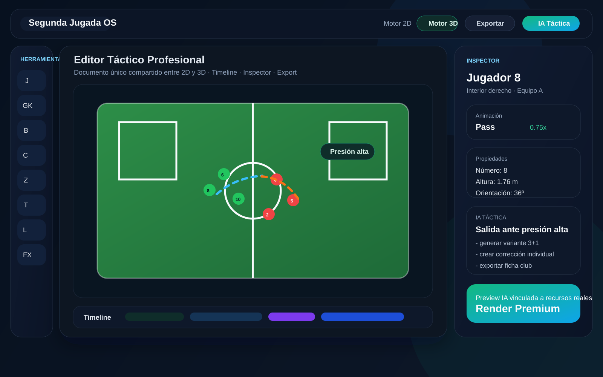
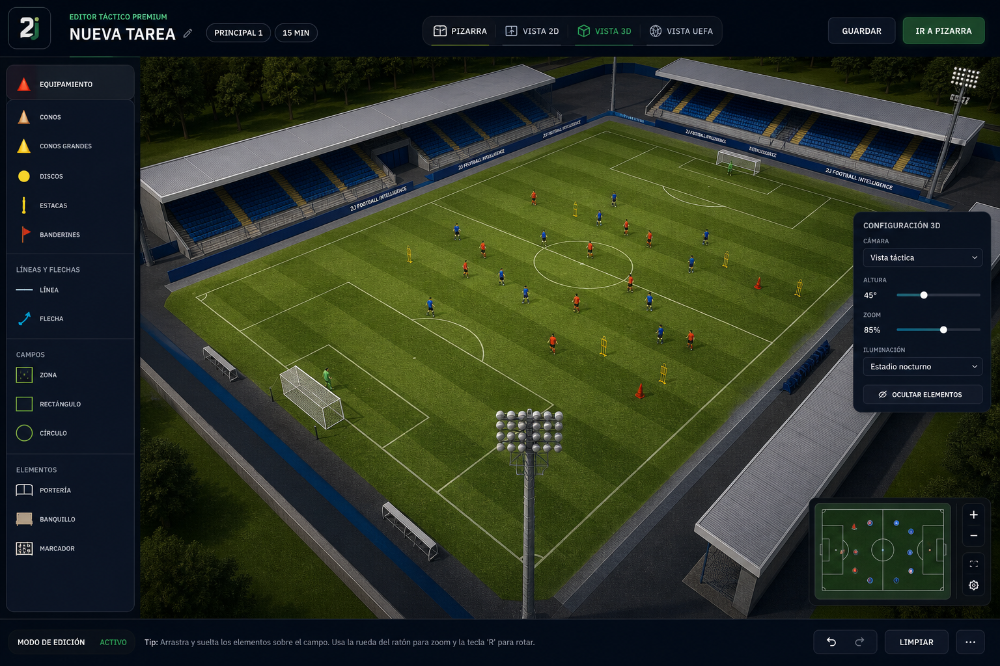
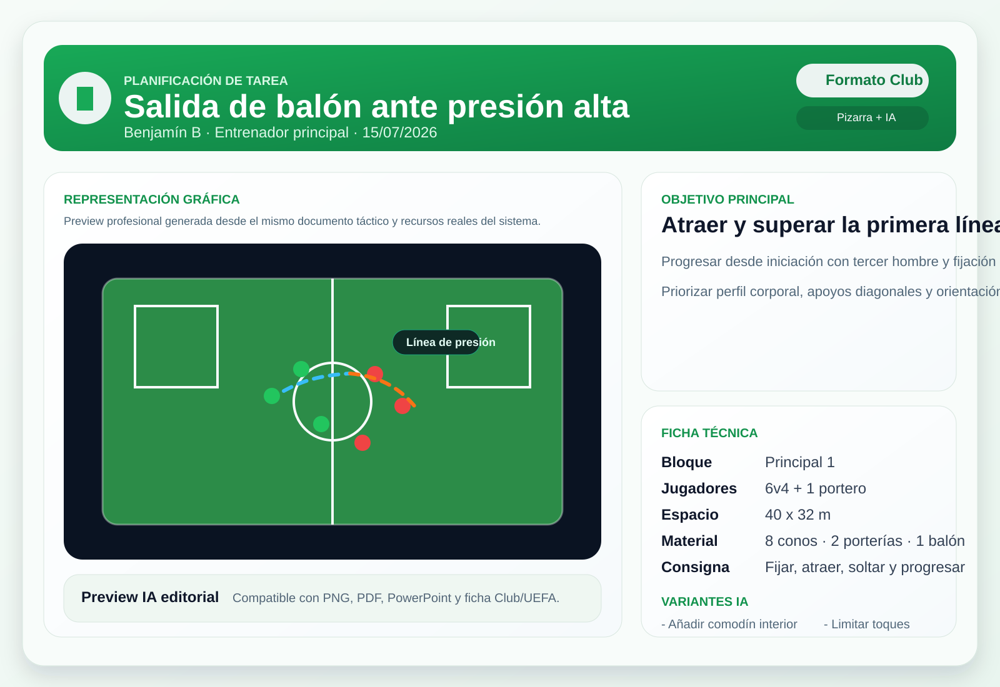

# MASTER PLAN

## Contexto

Este documento resume la inspección técnica del proyecto actual de Segunda Jugada Football Intelligence y propone una arquitectura objetivo para construir un editor táctico profesional, comercializable y escalable.

Este documento **no inicia todavía la migración**. Sirve como base de decisión antes de ejecutar cambios estructurales.

Fecha de análisis: 2026-07-13

## Mockups de referencia

### Interfaz objetivo del editor

### Mockup premium generado para editor 3D

Referencia visual generada para aproximar un acabado comercial tipo editor táctico premium, con lenguaje cercano a herramientas modernas de análisis y pizarra profesional.

### Ficha Club + preview profesional de tarea

---

## 1. Resumen Ejecutivo

El producto actual **no está construido sobre el stack objetivo** ni sigue una arquitectura limpia para un editor táctico de nueva generación.

Estado real detectado:

- Backend principal: `Django 4.2`
- Frontend principal: `Django templates + JavaScript vanilla`
- Editor táctico actual: `Fabric.js + Three.js + lógica inline muy acoplada`
- Motor principal del editor: archivo monolítico `football/static/football/js/sessions_tactical_pad.js` con **41.545 líneas**
- Capa HTTP principal: `football/views.py` con **69.216 líneas**
- Modelo de dominio principal: `football/models.py` con **3.811 líneas**
- Enrutado funcional: `football/urls.py` con **306 líneas**

Conclusión:

- El producto actual contiene mucho valor funcional.
- La base actual **sí permite extraer dominio, datos y workflows**.
- Pero el editor táctico profesional que se quiere construir **requiere una nueva arquitectura frontend y una separación real entre dominio, render, persistencia y presentación**.

La recomendación es:

- **no reescribir todo de golpe**
- **no romper el producto actual**
- construir un **Task Editor Platform** nuevo, modular, paralelo al editor actual
- migrar por fases hasta sustituir el editor legacy

---

## 2. Alcance de la Inspección

Se ha inspeccionado:

- estructura de proyecto
- dependencias Python y Node
- settings y middleware Django
- sistema de autenticación
- sistema de sesiones y tareas
- modelos principales
- rutas principales
- sistema de render 2D/3D
- editor táctico actual
- exportación PDF/preview 2D/3D
- sistema de análisis y video studio
- librerías de assets
- presencia de pruebas automatizadas

---

## 3. Estado Actual del Proyecto

### 3.1 Estructura

Proyecto monolítico Django con una sola app dominante:

- `webstats/` infraestructura del proyecto Django
- `football/` dominio funcional principal
- `football/templates/football/` vistas HTML
- `football/static/football/js/` JS de cliente
- `football/render_engine/` servicios de preview/render
- `mobile/` wrapper Capacitor
- `scripts/` utilidades de QA, generación de assets, render y automatización
- `docs/` documentación parcial

### 3.2 Stack real detectado

#### Backend

- Django
- Gunicorn / Uvicorn
- PostgreSQL vía `dj-database-url`
- S3 opcional con `django-storages`
- Stripe
- WeasyPrint para PDF
- OCR con `pytesseract`
- OpenCV
- `python-pptx`
- `pypdf`

#### Frontend

- Django templates
- JavaScript vanilla
- Fabric.js
- Three.js
- CSS estático propio

#### Stack objetivo solicitado

- React
- TypeScript
- Vite
- Tailwind
- Zustand
- Framer Motion
- Three.js
- React Three Fiber
- Drei

#### Brecha clave

El stack objetivo **no existe todavía en el repositorio principal**.

No se ha detectado:

- Vite
- React app principal
- TypeScript frontend principal
- Zustand
- Tailwind
- React Three Fiber
- Drei
- arquitectura de componentes React

### 3.3 Dependencias Node

`package.json` raíz es mínimo y está orientado a tooling:

- `three`
- `playwright`
- `sharp`
- `svgo`
- `@gltf-transform/cli`

No hay una SPA moderna instalada.

### 3.4 Dependencias móviles

`mobile/package.json` usa Capacitor como shell nativo, pero no hay una app React moderna asociada al editor.

---

## 4. Hallazgos por Área

### 4.1 Arquitectura general

#### Problemas encontrados

- Monolito extremo en `views.py`
- Lógica de dominio, presentación, persistencia y render mezcladas
- Alto acoplamiento entre backend Django, plantillas HTML y JS del editor
- Muchas responsabilidades en pocos archivos gigantes
- Escasa separación entre casos de uso y endpoints
- Demasiada lógica procedural en cliente y servidor

#### Impacto

- difícil de mantener
- difícil de testear
- difícil de escalar por equipos
- alto riesgo de regresiones
- onboarding lento para nuevos desarrolladores

### 4.2 Modelos / dominio

El dominio es rico y valioso. Hay entidades para:

- workspaces
- equipos
- temporadas
- jugadores
- staff
- microciclos
- sesiones
- tareas
- backups de tareas
- bookmarks
- colecciones
- imports PDF
- video studio
- IA de vídeo
- análisis rival
- academia
- billing
- permisos y roles

#### Problemas encontrados

- `football/models.py` concentra demasiadas bounded contexts
- el dominio no está modularizado por subdominios
- `SessionTask.tactical_layout` es JSON multipropósito y actúa como contenedor de estado del editor
- hay mezcla de entidades core con entidades de infraestructura y producto

#### Oportunidades

- existe una base de negocio real reutilizable
- se puede extraer un dominio `Training / Task / Tactical / Video / Workspace`
- `SessionTask`, `TrainingSession` y `TaskStudioTask` permiten diseñar una nueva capa de aplicación sin perder compatibilidad

### 4.3 Rutas

Se han detectado muchas áreas funcionales:

- dashboard
- plataforma
- sesiones
- task studio
- análisis
- video studio
- players
- coach
- billing
- academy
- sharing

#### Problemas encontrados

- routing demasiado horizontal dentro de un único `football/urls.py`
- API y páginas HTML mezcladas
- conviven rutas de producto maduro con rutas experimentales
- no hay un API namespace consistente de nueva generación

#### Oportunidades

- crear una nueva API modular para el editor: `api/v2/tactical-*`
- mantener las rutas legacy mientras se migra

### 4.4 Backend

El backend actual resuelve muchas funciones de producto:

- guardado de tareas
- generación de previews
- generación PDF
- importaciones
- video studio
- análisis IA
- librería de recursos

#### Problemas encontrados

- lógica de aplicación masiva embebida en `views.py`
- endpoints fat controller
- falta de capa formal de use cases
- falta de DTOs/versionado claro para el editor
- lógica de render invocada desde vistas con dependencias implícitas

#### Oportunidades

- crear módulos `application/`, `domain/`, `infrastructure/` por contexto
- exponer API typed para el nuevo editor sin romper el backend actual

### 4.5 Frontend

El frontend actual se apoya en:

- plantillas Django
- JS vanilla por página
- un editor principal en `sessions_tactical_pad.js`

Archivos relevantes detectados:

- `football/static/football/js/sessions_tactical_pad.js`
- `football/static/football/js/tactical_pad_shared.js`
- `football/static/football/js/session_task_detail_3d.js`
- `football/static/football/js/pitch_surface_25d.js`

#### Problemas encontrados

- ausencia de arquitectura de componentes
- ausencia de tipado
- ausencia de estado global formal
- lógica UI, render, eventos, persistencia y exportación mezcladas
- dificultad extrema para refactorizar sin romper

#### Oportunidades

- el editor actual sirve como mapa funcional
- se puede usar como referencia para extraer:
  - toolbar
  - canvas interactions
  - presets
  - recursos
  - timeline
  - export

### 4.6 Renderizado 2D

Estado actual:

- 2D apoyado en Fabric.js
- previews 2D server-side mediante `preview_render.py` y `render_engine`
- representación del campo y assets ya existente

#### Problemas encontrados

- el 2D actual no está desacoplado como motor independiente
- el estado 2D parece ligado a estructuras JSON específicas del editor actual
- falta un schema robusto y versionado del documento táctico

#### Oportunidades

- el 2D actual es la mejor fuente para definir el `TacticalDocument`
- puede migrarse a un motor React Canvas/SVG manteniendo formato intermedio

### 4.7 Renderizado 3D

Estado actual:

- Three.js ya presente
- render 3D en modal/preview
- pipeline de assets GLB/GLTF
- utilidades de captura
- múltiples scripts de construcción de estadio
- `renderer_3d.py` usa generación de snapshot 3D

#### Problemas encontrados

- el motor 3D actual no es un editor 3D de arquitectura moderna
- el 3D está acoplado a flujos de preview, modal y PDF
- existe complejidad acumulada en el estadio procedural y assets
- no hay shared scene graph formal entre 2D y 3D

#### Oportunidades

- la experiencia adquirida en estadio, assets y snapshots ya es reutilizable
- Three.js actual puede migrarse a React Three Fiber
- se puede compartir estado entre motores desde un documento único

### 4.8 Assets

Se ha detectado una base rica:

- `assets_library/players`
- `assets_library/goals`
- `assets_library/grass`
- `assets_library/stadiums`
- `assets_library/icons`
- `assets_library/cones`
- `assets_library/textures`

#### Problemas encontrados

- catálogo distribuido pero no unificado en un asset registry moderno
- falta normalización por tipo, versión, licencia, LOD y uso 2D/3D
- mezcla de PNG/SVG/GLB/manifest sin pipeline único

#### Oportunidades

- crear `Asset Registry`
- separar assets editoriales, tácticos y render
- preparar atlas, Draco, LOD y versionado

### 4.9 Sistema de autenticación

Estado actual:

- Django auth
- login adaptado por rol
- backend case-insensitive
- soporte de `service-login`
- middleware para host canónico, sticky workspace, sanitización de cookies

#### Problemas encontrados

- auth muy ligada al monolito web
- roles y navegación post-login acoplados a rutas legacy
- no hay BFF/API auth strategy específica para una SPA avanzada

#### Oportunidades

- mantener Django auth como fuente inicial
- introducir capa API segura para React app
- evolucionar a sesión compartida o token short-lived para editor

### 4.10 Sistema de tareas

Estado actual fuerte:

- `TrainingSession`
- `SessionTask`
- `TaskStudioTask`
- previews
- PDFs
- guardado gráfico
- recreación desde preview/PDF

#### Problemas encontrados

- duplicidad conceptual entre `SessionTask` y `TaskStudioTask`
- `tactical_layout` JSON demasiado abierto
- builder actual muy acoplado a la página y a la ficha legacy

#### Oportunidades

- diseñar un `TacticalDocument v1`
- separar `TaskEntity` de `TaskPresentation`
- separar `TaskMetadata`, `TaskCanvasState`, `TaskAnimationTimeline`, `TaskExports`

### 4.11 Sistema de exportación

Estado actual:

- PDF con WeasyPrint
- PPTX para análisis de vídeo
- previews 2D
- snapshots 3D
- share links

#### Problemas encontrados

- exportación distribuida en varias áreas y servicios
- dependencia sensible de entorno para PDF
- no existe pipeline único de exportación del editor
- no hay todavía motor de vídeo táctico comercial de alto nivel

#### Oportunidades

- crear `Export Service` unificado
- exportes por adaptadores:
  - PNG
  - PDF
  - PPTX
  - MP4
  - GIF
  - HTML share

### 4.12 Sistema de análisis

Estado actual:

- módulo de análisis rival
- video studio
- IA local/OpenAI en varias zonas
- tracking con YOLO
- OCR
- generación de reportes

#### Problemas encontrados

- gran potencia funcional pero muy dispersa
- alto acoplamiento entre UI, procesos y datos
- la IA táctica del editor aún no está unificada como producto

#### Oportunidades

- el nuevo editor puede convertirse en la superficie central de creación de conocimiento táctico
- existe ya una base para copiloto táctico y automatización de tareas

---

## 5. Limitaciones Técnicas Actuales

### 5.1 Limitaciones estructurales

- monolito muy grande
- frontend no tipado
- editor actual no modular
- ausencia de frontera clara entre dominio y UI

### 5.2 Limitaciones del stack actual frente al objetivo

- no hay React
- no hay TypeScript frontend principal
- no hay Zustand
- no hay Tailwind
- no hay React Three Fiber
- no hay Drei
- no hay Vite como app shell principal

### 5.3 Limitaciones de mantenibilidad

- alta dependencia de archivos gigantes
- coste elevado para pruebas de regresión
- complejidad accidental acumulada

### 5.4 Limitaciones de producto

- editor actual todavía no se comporta como Figma especializado
- 2D y 3D no comparten un store formal y único
- timeline no está resuelto como sistema profesional de keyframes
- paneles e inspector no están diseñados como un workstation premium

---

## 6. Oportunidades Estratégicas

### 6.1 Reutilización de dominio

Se puede reutilizar:

- usuarios
- workspaces
- equipos
- temporadas
- sesiones
- tareas
- permisos
- exportaciones
- análisis

### 6.2 Reutilización de render y assets

Se puede reutilizar parcialmente:

- catálogo de assets
- previews 2D
- captura 3D
- pipeline GLB/GLTF
- scripts de QA visual

### 6.3 Reutilización de workflows de negocio

Se puede conservar:

- creación/edición de tareas
- guardado de tareas en sesión o biblioteca
- PDFs
- compartición
- IA de apoyo

### 6.4 Posicionamiento de producto

Si se ejecuta correctamente, Segunda Jugada puede evolucionar de:

- CRM + planner + tools

a:

- **Operating System táctico para staff técnico**

---

## 7. Arquitectura Objetivo Propuesta

## 7.1 Principios

- Clean Architecture
- modularidad real
- shared state único
- separación 2D/3D por motores, no por datos
- backward compatibility durante transición
- diseño API-first
- rendering-first UX

## 7.2 Arquitectura de alto nivel

### Backend

Mantener Django como plataforma de negocio inicial, pero reorganizar por contextos:

- `domain/`
- `application/`
- `infrastructure/`
- `interfaces/http/`

Subdominios propuestos:

- Identity & Access
- Workspace
- Team & Season
- Training
- Tactical Editor
- Asset Library
- Export
- Analysis & Video
- AI Assistant

### Frontend

Nueva aplicación independiente:

- `apps/tactical-editor/`
- React + TypeScript + Vite
- Tailwind
- Zustand
- Framer Motion
- React Three Fiber + Drei

### Documento único de estado

Crear una entidad central:

- `TacticalDocument`

Contenido mínimo:

- metadata
- scene
- layers
- objects
- styles
- constraints
- timeline
- cameras
- export settings

### Motores

#### Motor 2D

Responsable de:

- edición plana
- selección
- snapping
- capas
- zonas
- trayectorias
- texto
- presets

#### Motor 3D

Responsable de:

- representación espacial
- estadio 3D
- jugadores low poly
- cámaras
- iluminación
- animaciones
- timeline preview

#### Regla principal

Ambos motores deben leer y escribir sobre el mismo store:

- un solo estado
- dos representaciones
- cero duplicación de datos

### Store

Zustand dividido por slices:

- `documentSlice`
- `selectionSlice`
- `toolSlice`
- `viewport2dSlice`
- `viewport3dSlice`
- `timelineSlice`
- `assetSlice`
- `historySlice`
- `exportSlice`
- `aiAssistantSlice`

### Persistencia

Persistir `TacticalDocument` en backend como schema versionado:

- `tactical_document_version`
- `tactical_document_payload`
- `render_cache`
- `export_cache`

### Exportaciones

Pipeline modular:

- render PNG 2D
- render PNG 3D
- composición PDF
- composición PPTX
- render MP4/GIF
- web share bundle

---

## 8. Diseño del Nuevo Editor

## 8.1 Layout

- cabecera superior
- toolbar izquierda
- inspector derecha
- timeline inferior
- canvas central
- minimapa
- panel de capas
- panel de assets

## 8.2 Herramientas

Herramientas objetivo confirmadas:

- Jugador
- Portero
- Balón
- Cono
- Pica
- Escalera
- Aro
- Miniportería
- Portería
- Muro
- Maniquí
- Zona
- Texto
- Cronómetro
- Silbato
- Borrar
- Duplicar
- Agrupar
- Bloquear
- Capas

## 8.3 Timeline

Debe migrar desde estado simple a sistema pro:

- keyframes
- tracks por objeto
- posición
- rotación
- escala
- animación
- velocidad
- wait
- easing
- paths

## 8.4 Objetos

Cada objeto tendrá:

- `id`
- `type`
- `transform2d`
- `transform3d`
- `style`
- `physics/meta`
- `animationTrack`
- `constraints`
- `assetRef`

## 8.5 Estadio 3D

No debe ser una imagen.

Debe ser un conjunto de sistemas:

- `stadium-shell`
- `seating-bowl`
- `pitch-system`
- `goal-system`
- `dugout-system`
- `lighting-system`
- `scoreboard-system`
- `environment-system`
- `camera-system`

---

## 9. Problemas Críticos Encontrados

### Crítico 1

`football/views.py` concentra demasiadas responsabilidades.

### Crítico 2

`sessions_tactical_pad.js` no es sostenible como base del editor comercial final.

### Crítico 3

No existe un modelo tipado único compartido entre 2D y 3D.

### Crítico 4

La UI actual no está diseñada como workstation profesional modular.

### Crítico 5

El stack actual no coincide con el stack objetivo de producto.

### Crítico 6

La persistencia del editor depende de JSON flexible sin contrato fuerte.

### Crítico 7

El sistema de exportación existe, pero no como pipeline centralizado del editor.

### Crítico 8

El dominio está mezclado: training, academy, video, billing y tactical comparten demasiado espacio físico.

---

## 10. Estrategia Recomendada

## 10.1 Qué NO hacer

- no rehacer todo el backend de golpe
- no reescribir el monolito entero en una fase
- no seguir ampliando el editor legacy como base definitiva
- no mezclar la nueva app React con más lógica procedural inline

## 10.2 Qué SÍ hacer

- crear un editor nuevo en paralelo
- conservar el dominio y workflows útiles
- encapsular el legacy tras adaptadores
- introducir contrato de documento táctico
- migrar por módulos y con feature flags

---

## 11. Fases de Desarrollo Propuestas

## Fase 0. Fundaciones y Gobernanza

Objetivo:

- definir contratos
- definir arquitectura
- preparar convivencia legacy/nuevo

Entregables:

- RFC de arquitectura
- schema `TacticalDocument`
- estrategia de versionado
- convenciones de carpetas
- plan de migración de rutas
- creación de `docs/ROADMAP.md`
- creación de `docs/CHANGELOG.md`

## Fase 1. Core del nuevo Editor Frontend

Objetivo:

- levantar la nueva app React/TS/Vite

Entregables:

- shell del editor
- dark mode
- layout base
- Zustand store
- sistema de history/undo-redo
- paneles modulares
- integración inicial con auth/backend

## Fase 2. Motor 2D Profesional

Objetivo:

- construir el motor de edición táctica 2D como producto serio

Entregables:

- canvas 2D
- herramientas básicas
- selección múltiple
- snap/grid/guides
- layers
- grouping
- locking
- minimap
- inspector de propiedades

## Fase 3. TacticalDocument y Persistencia

Objetivo:

- unificar el estado y guardado

Entregables:

- contrato persistente del documento
- adaptador backend
- migración desde `tactical_layout`
- autosave
- versioning
- backups

## Fase 4. Motor 3D Compartido

Objetivo:

- representar el mismo estado en 3D

Entregables:

- R3F scene
- cámaras
- estadio modular
- jugadores low poly
- objetos 3D
- sincronización instantánea con store

## Fase 5. Timeline y Animación

Objetivo:

- convertir el editor en sistema de secuencias y no solo pizarra estática

Entregables:

- keyframes
- tracks
- interpolación
- motion paths
- animation controls
- reproducción

## Fase 6. Export Engine

Objetivo:

- profesionalizar las salidas comerciales

Entregables:

- PNG
- PDF
- PPTX
- MP4
- GIF
- ficha Club
- ficha UEFA
- web animation share

## Fase 7. Copiloto IA Táctico

Objetivo:

- generación asistida de tareas y variantes

Entregables:

- prompt-to-task
- prompt-to-layout
- prompt-to-animation
- variantes
- feedback coaching
- correcciones automáticas

## Fase 8. Hardening comercial

Objetivo:

- dejar el producto listo para vender

Entregables:

- performance
- telemetry
- feature flags
- access control
- crash reporting
- QA visual
- documentación operativa

---

## 12. Riesgos

### Riesgo 1

Seguir desarrollando el editor legacy mientras se migra puede aumentar deuda si no se limita el alcance.

### Riesgo 2

Una reescritura total sin adaptadores puede romper los flujos actuales de sesiones y exportación.

### Riesgo 3

Si no se define pronto el `TacticalDocument`, 2D y 3D volverán a divergir.

### Riesgo 4

Si el estadio 3D se construye sin sistema modular, volverá a aparecer deuda geométrica similar a la actual.

---

## 13. Recomendación Final

La plataforma actual contiene suficiente negocio, datos, workflows y activos como para **no tirar nada**.

Pero el editor táctico profesional objetivo **no debe evolucionar dentro del mismo patrón legacy**.

La decisión recomendada es:

1. congelar la arquitectura legacy como base operativa
2. diseñar el nuevo editor como producto separado dentro del repositorio
3. reutilizar dominio y exportes mediante adaptadores
4. migrar por fases con validación continua

---

## 14. Próximo Paso Propuesto

Si apruebas este documento, la siguiente entrega debe ser:

- definición detallada de la arquitectura de carpetas
- diseño del `TacticalDocument`
- roadmap técnico inicial
- creación del shell React + TypeScript + Vite en paralelo al editor actual

Sin tocar todavía funcionalidades de negocio existentes.
